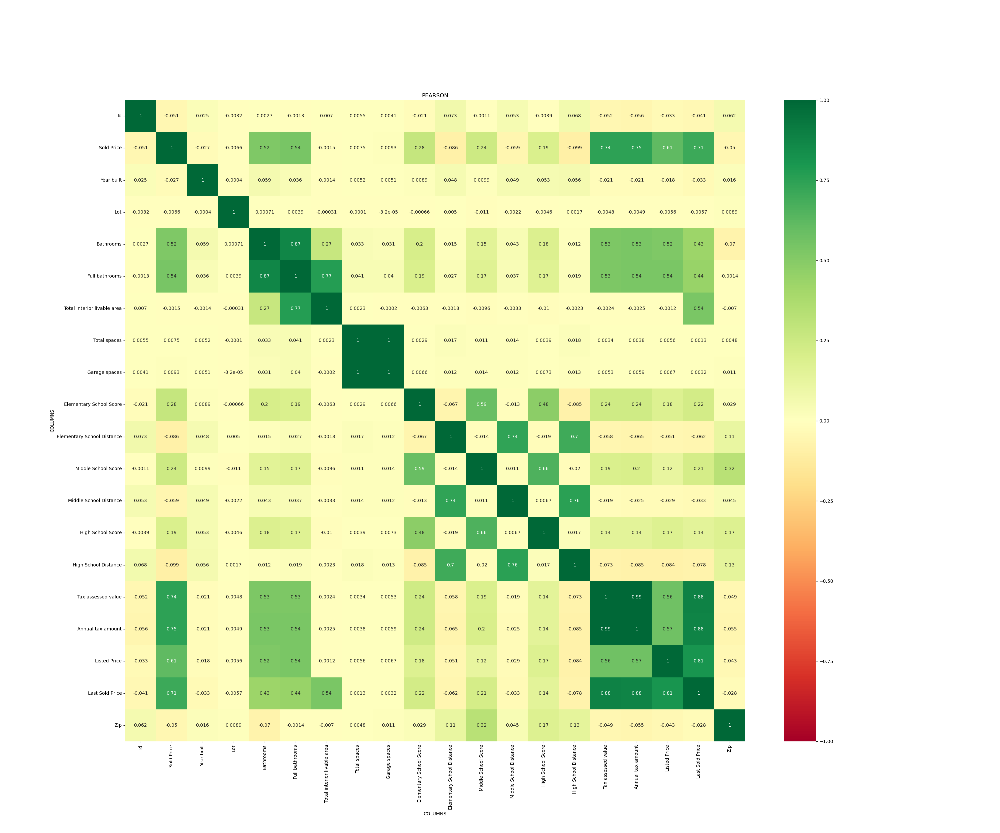

### Kaggle：california-house-price

#### 特征工程：

在本数据集中，存在着40个特征，包括数值特征以及文本特征，全部用来训练会造成浪费，甚至在离散值进行onehot编码时会造成维度灾难，所以过滤选取合适的特征尤为重要

所有特征如下所示：

```python
['Id', 'Address', 'Sold Price', 'Summary', 'Type', 'Year built', 'Heating', 'Cooling', 'Parking', 'Lot', 'Bedrooms', 'Bathrooms', 'Full bathrooms', 'Total interior livable area', 'Total spaces', 'Garage spaces', 'Region', 'Elementary School', 'Elementary School Score', 'Elementary School Distance', 'Middle School', 'Middle School Score', 'Middle School Distance', 'High School', 'High School Score', 'High School Distance', 'Flooring', 'Heating features', 'Cooling features', 'Appliances included', 'Laundry features', 'Parking features', 'Tax assessed value', 'Annual tax amount', 'Listed On', 'Listed Price', 'Last Sold On', 'Last Sold Price', 'City', 'Zip', 'State']
```

- 数值特征：

  数值特征有：

  ```python
  ['Id', 'Sold Price', 'Year built', 'Lot', 'Bathrooms', 'Full bathrooms',
         'Total interior livable area', 'Total spaces', 'Garage spaces',
         'Elementary School Score', 'Elementary School Distance',
         'Middle School Score', 'Middle School Distance', 'High School Score',
         'High School Distance', 'Tax assessed value', 'Annual tax amount',
         'Listed Price', 'Last Sold Price', 'Zip']
  ```

  进行相关性分析，得到相关矩阵：

  

  选取特征为：

  ```python
  numeric_main_features = ['Bathrooms', 'Full bathrooms', 'Tax assessed value', 'Annual tax amount', 'Listed Price','Last Sold Price']
  ```

- 离散特征：

  对各离散特征进行统计（离散特征要转换为独热编码）,选取类别小于1000的特征（太大的特征会使得独热编码及其稀疏）

  ```python
  object_main_features = ['Type', 'Cooling', 'Bedrooms', 'Region', 'Middle School', 'High School', 'Cooling features','City', 'State']
  ```
  
  独热编码后的数据尺寸为(79065, 6082)

#### 模型训练：

本来想使用K折交叉验证，k取5，但是在colab上测试发现k取5的话数据量过大，内存在第二次交叉验证时就满了了。最终还是随机取将打乱后的数据按照8：2分训练集和验证集

超参数设置如下：

```python
k, num_epochs, lr, weight_decay, batch_size = 5, 100, 5, 0, 16
```

超参数没有经过过多调整，经过两次提交效果如下


该次工作简单的学习了机器学习数据分析的基本方法，在以后学习之后可以回头再做一次该任务

改进方向：

- 对文本数据利用Transformer处理
- 进行集成学习
- 对异常数据的处理

更多工作的方向：

- [10行代码战胜90%数据科学家？_哔哩哔哩_bilibili](https://www.bilibili.com/video/BV1rh411m7Hb/?spm_id_from=333.337.search-card.all.click)

- h2o：https://www.kaggle.com/wuwawa/automl-using-h2o

- 随机森林：https://www.kaggle.com/jackzh/the-4th-place-approach-random-forest